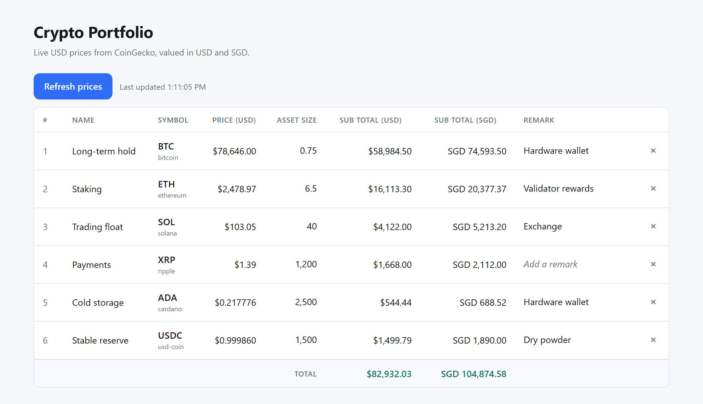
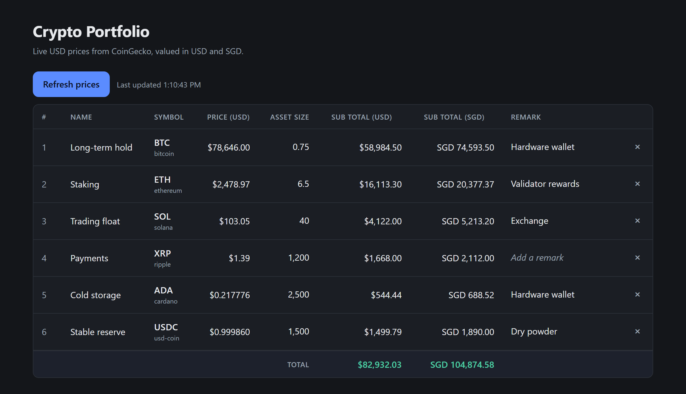

# Crypto Portfolio Dashboard

A local, single-user dashboard for tracking crypto holdings. Prices come from CoinGecko and every
position is valued in both USD and SGD. Prices refresh only when you ask them to.





<sub>Demo data, not a real portfolio. The theme follows your system setting.</sub>

## Quick start

```bash
npm install
npm start
```

The first launch asks you to choose a passphrase (twice), encrypts your holdings, and then
serves <http://localhost:3000>. Every later launch asks for it once to unlock. Typing shows one
`*` per character; backspace works, Ctrl+C aborts.

The prompt needs a real terminal. Launched without one — from an IDE run button, a task runner, or
anything that pipes stdin — the server refuses to start rather than proceeding unencrypted.

No API key is required — the dashboard uses CoinGecko's public free tier. If you have a Demo key
and want the higher rate limit, copy `.env.example` to `.env` and set `COINGECKO_API_KEY` (or just
export it in the shell before `npm start`).

## What it does

- **Add a holding** — search by symbol or name, pick the exact coin from the results, give it your
  own label and the asset size.
- **Edit an asset size** — click the number in the Asset Size column and type a new one. Enter or
  clicking away saves; Escape abandons the edit. Prices and totals recompute immediately.
- **Add a remark** — free text per holding in the last column, edited the same way (click, type,
  Enter to save, Escape to cancel). Up to 200 characters; save an empty one to clear it.
- **Remove a holding** — click `×` on the row, then click `Remove?` to confirm (the confirm resets
  itself after 4 seconds).
- **Refresh prices** — the button above the table; the timestamp beside it shows the last successful
  fetch. Prices are also fetched once on page load. Nothing polls in the background.
- **Table columns** — `#`, Name, Symbol, Price (USD), Asset Size, Sub Total (USD), Sub Total (SGD),
  Remark, with a totals row at the bottom.
- **Sort by value** — click either sub-total header: largest first, then smallest first, then back
  to the order you added them. The `#` column keeps each holding's original item number, so a
  sorted table shows at a glance where each position ranks. Sorting is client-side and survives a
  price refresh; holdings with no price sort to the bottom either way.

### Why you pick the coin from a list

CoinGecko is keyed by *coin id* (`bitcoin`), not by ticker, and tickers are not unique — searching
`SOLANA` returns a memecoin, not Solana. The picker stores the canonical coin id alongside the
symbol so the price always resolves to the asset you actually meant.

## Encryption

`data/portfolio.json` is encrypted at rest with **AES-256-GCM**. The key is derived from your
passphrase with **scrypt** (N=32768, r=8, p=1) and exists only in the server process's memory —
nothing on disk can decrypt the file.

- **Every write gets a fresh random IV**, and the auth tag means an edited file is rejected rather
  than silently decrypted into garbage.
- **The file is self-describing**: it records the cipher, the KDF parameters, and the salt, so the
  parameters can be raised later without stranding data you already have.
- **A wrong passphrase stops the server** with `Wrong passphrase, or the file has been altered.`
  and exit code 1. It never falls back to writing plaintext.
- **There is no recovery.** Forget the passphrase and the holdings are gone — re-enter them by
  hand. Keep it in a password manager.

### What this does and does not protect

It protects the file: a copy of `data/portfolio.json` lifted from a backup, a synced cloud folder,
a stolen drive, or a repo you accidentally pushed reveals nothing. It does **not** protect against
someone who is already on your machine while the server is running — the decrypted holdings are in
memory and served over plain HTTP on localhost.

### Migrating an existing plaintext portfolio

The first `npm start` after upgrading detects the plaintext file, encrypts it in place, and keeps
the original at `data/portfolio.json.plain.bak`. **Delete that backup once you have confirmed you
can unlock** — until you do, your holdings are still sitting there in the clear.

### Unattended runs

`npm run dev` cannot prompt on every `--watch` restart, so it reads `PORTFOLIO_PASSPHRASE` from a
git-ignored `.env` (see `.env.example`). That puts the passphrase on disk beside the data and gives
up most of the benefit — use it for development, not for your real portfolio. `npm start` never
reads `.env`.

## Scripts

| Command | Does |
| --- | --- |
| `npm start` | Run the server on port 3000 (override with `PORT`). |
| `npm run dev` | Same, with `node --watch` restarts on file changes. |
| `npm test` | Unit tests for the valuation logic (`node --test`). |

## Layout

```
server.js              express wiring
src/storage.js         data/portfolio.json read/write (encrypted, atomic, serialized)
src/crypto.js          AES-256-GCM envelope + scrypt key derivation
src/passphrase.js      hidden startup prompt
src/coingecko.js       the only file that talks to CoinGecko
src/portfolio.js       pure valuation: rows + totals
src/routes.js          REST API
public/                index.html, app.js, styles.css — no build step
data/portfolio.json    your holdings, encrypted (git-ignored, created on first run)
```

## API

| Method | Route | Purpose |
| --- | --- | --- |
| `GET` | `/api/portfolio` | Holdings + live prices + computed rows and totals. |
| `GET` | `/api/search?q=` | Coin lookup for the add form. |
| `POST` | `/api/holdings` | `{name, symbol, coinId, amount}` |
| `PATCH` | `/api/holdings/:id` | `{amount}` and/or `{remark}` — change an asset size or note. |
| `DELETE` | `/api/holdings/:id` | Remove one holding. |

## Notes

- **Price outages don't blank the table.** If CoinGecko is unreachable or rate-limits you (HTTP
  429), the table still lists your holdings with `—` prices and a banner explains why. One batched
  request covers all holdings, so a refresh costs a single API call.
- **Amounts are JavaScript numbers** (float64). That is fine for a display dashboard; if this ever
  becomes an accounting tool, amounts should move to a decimal type.
- **No auth.** It binds to localhost and anyone who can reach the port sees the decrypted
  portfolio — keep it local, or add auth before exposing it beyond your machine.

## License

[MIT](LICENSE) © kodence
